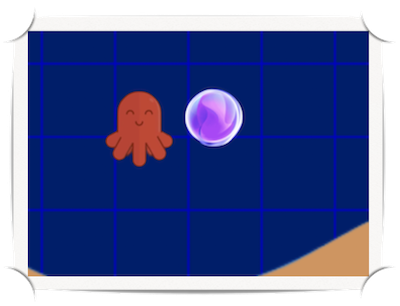

# the squid and the whale
## kalman filters in action

### setup

If using Anaconda:

    conda create -n kalman-env python=3.8
    conda activate kalman-env
    pip install -r requirements.txt

Otherwise:

    python -m venv kalman-env
    source kalman/bin/activate 
    pip install -r requirements.txt

### running the code

To run the 1-D Kalman filter demo:

    python kalman.py

To run the 2-D Kalman filter demo:

    python kalman2d.py